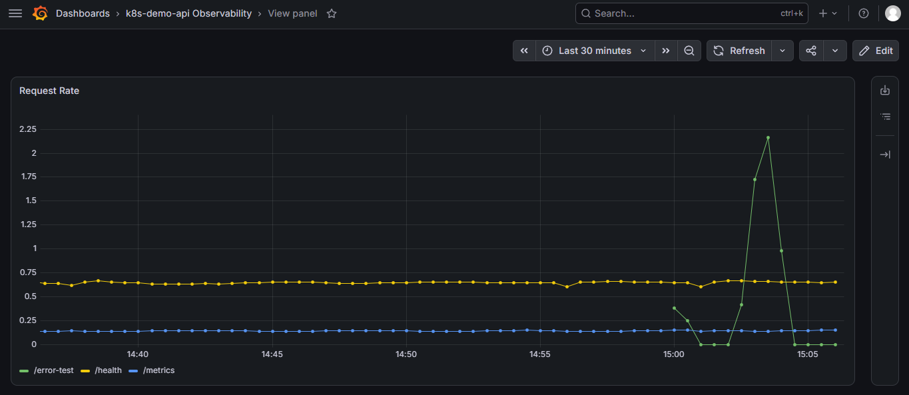
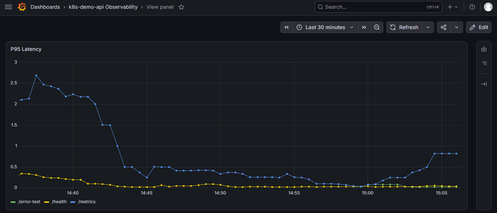
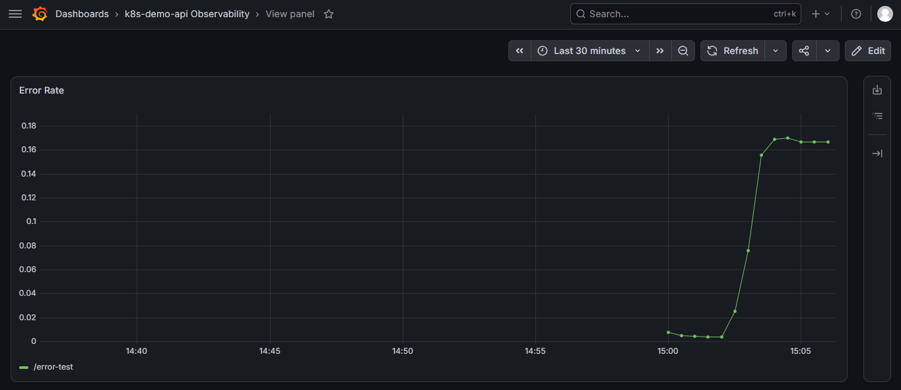

# k8s-demo-api — Docker + Kubernetes (kind) + Helm + Observability

A minimal REST API, containerized with Docker and deployed onto a real
local Kubernetes cluster via `kind`, packaged and managed with a Helm
chart, and monitored with a full Prometheus + Grafana observability
stack. Demonstrates container orchestration and production-style
monitoring end-to-end, entirely on free, open-source tooling — no
cloud account, no card, no cost.

## Why this exists

Container orchestration (Kubernetes, Helm) and observability
(Prometheus, Grafana) are core requirements for cloud infrastructure.
Building an image, running it as multiple replicas on a real cluster, 
health-checked and load-balanced by Kubernetes itself. Instrumented 
so its request rate, latency, and error rate are actually visible, 
not just assumed.

## Stack

- **Node.js / Express** — the demo API itself (kept intentionally
  simple so the repo's focus stays on the orchestration and
  observability layers)
- **prom-client** — exposes Prometheus-format metrics from the app
  (`/metrics`)
- **Docker** — containerizes the app
- **[kind](https://kind.sigs.k8s.io/)** — runs a real local Kubernetes
  cluster inside Docker, free and open-source
- **Helm** — templated, versioned Kubernetes deployment
- **kube-prometheus-stack** — Prometheus, Grafana, and Alertmanager,
  self-hosted via Helm, no external account or SaaS tier
- **[Trivy](https://github.com/aquasecurity/trivy)** — container
  vulnerability scanning
- **GitHub Actions** — builds the image, scans it with Trivy, and
  lints the Helm chart on every PR

## Architecture

    Docker image (k8s-demo-api)
             |
      kind cluster (local K8s)
             |
    Deployment (2 replicas) ---- readiness/liveness probes on /health
             |                            |
     Service (NodePort 30080)      /metrics endpoint (prom-client)
             |                            |
     reachable at localhost:30080   ServiceMonitor (Prometheus Operator)
                                           |
                                      Prometheus (scrapes every 15s)
                                           |
                                        Grafana (dashboards)

## Security scanning

CI runs [Trivy](https://github.com/aquasecurity/trivy) against the
built Docker image on every push, failing the build on any
CRITICAL/HIGH vulnerability with a known fix.

The first scan flagged CVEs in two places, both fixed with real
changes rather than suppression:

- **npm's bundled internals** (`tar`, `minimatch`, `pacote`,
  `sigstore`) — these come from npm's own CLI tooling, not the app's
  dependencies. Fixed by switching to a multi-stage Docker build: a
  `builder` stage installs dependencies with npm, then the final
  runtime image copies only the built app and strips npm's CLI out
  entirely, since the container only needs `node` to run, not `npm`.
- **Base image OS packages** (OpenSSL/`libssl3`) — Alpine's OS-level
  packages had known CVEs. Fixed with an `apk upgrade` step in the
  final image, pulling in patched versions before the app is copied
  in.

Both fixes were verified locally (build, run, `curl /health`) before
being pushed, so the image stayed functionally identical throughout.

## Running it locally

```bash
# 1. Create the local Kubernetes cluster
kind create cluster --name k8s-demo --config kind-config.yaml

# 2. Build the Docker image
docker build -t k8s-demo-api:local ./app

# 3. Load the image into the kind cluster
#    (kind runs its own Docker-in-Docker nodes, so images built
#    locally aren't visible to it until explicitly loaded)
kind load docker-image k8s-demo-api:local --name k8s-demo

# 4. Deploy the app with Helm
helm install demo ./helm/k8s-demo-api

# 5. Check the pods are running
kubectl get pods
kubectl get svc

# 6. Hit the API
curl http://localhost:30080/health
curl -X POST http://localhost:30080/notes -H "Content-Type: application/json" -d '{"text":"first note"}'
curl http://localhost:30080/notes
curl http://localhost:30080/metrics
curl http://localhost:30080/error-test

# 7. Install the monitoring stack
helm repo add prometheus-community https://prometheus-community.github.io/helm-charts
helm repo update
helm install monitoring prometheus-community/kube-prometheus-stack --namespace monitoring --create-namespace

# 8. Wire Prometheus to scrape the app
kubectl apply -f servicemonitor.yaml

# 9. Access Grafana
kubectl port-forward -n monitoring svc/monitoring-grafana 3000:80
# username: admin
# password:
kubectl get secret --namespace monitoring monitoring-grafana \
  -o jsonpath="{.data.admin-password}" | base64 --decode

# 10. Import the dashboard
#     In Grafana: Dashboards -> New -> Import -> paste contents of
#     grafana-dashboard.json

# 11. Tear down
helm uninstall demo
helm uninstall monitoring -n monitoring
kind delete cluster --name k8s-demo
```

## Dashboards

**Request Rate** — requests/sec by route


**P95 Latency** — 95th percentile response time by route


**Error Rate** — 5xx error rate, validated using a simulated failure route


Dashboard definition is version-controlled in
[`grafana-dashboard.json`](./grafana-dashboard.json), so it can be
re-imported into any Grafana instance rather than rebuilt by hand.

## What this demonstrates

- Writing a production-shaped Dockerfile (small base image, no dev deps,
  multi-stage build)
- Kubernetes fundamentals: Deployments, Services, replica counts,
  readiness/liveness probes
- Helm chart authoring: templated manifests, `values.yaml` for config
- Instrumenting an application with custom Prometheus metrics
  (request duration histograms, labeled by method/route/status)
- Using the Prometheus Operator's `ServiceMonitor` CRD to auto-discover
  scrape targets, rather than manually editing Prometheus config
- Building custom Grafana dashboards for application-level metrics —
  not just the default cluster/node dashboards
- Simulating realistic failure conditions (`/error-test`) so error-rate
  monitoring reflects real data instead of an empty graph
- Automated container vulnerability scanning (Trivy) integrated into
  CI, with real fixes for both dependency-level and OS-level CVEs
- CI that builds the image, scans it for vulnerabilities, and lints
  the chart on every PR